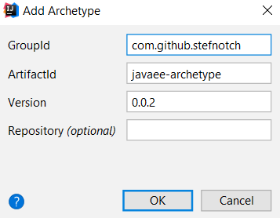

# A simple JavaEE Archetype

## Installing

```bash
git clone https://github.com/stefnotch/javaee-archetype.git
mvn install # IntelliJ Idea has a maven run configuration, you can use that as well
```

## Info


**Group id:** `com.github.stefnotch`

**Artifact id:** `javaee-archetype`

**Version:** `0.0.4`





Creating an Archetype sucks. Way too many steps and requires all sorts of software.

- Sonatype
- Shitty password rules
- Public key
- Bad documentation
- etc.


Leaving a bunch of links for myself here

- [Repo](https://github.com/stefnotch/javaee-archetype)
- [Example](https://github.com/AdamBien/javaee8-essentials-archetype)
- [Another example](https://bitbucket.org/simpligility/ossrh-pipeline-demo/src)
- [Maven Central Repo](https://mvnrepository.com/repos/sonatype-releases)
- [Sonatype Guide](https://central.sonatype.org/pages/ossrh-guide.html)
- [Ticket](https://issues.sonatype.org/browse/OSSRH-48186)


```
mvn clean deploy --settings settings.xml
```

